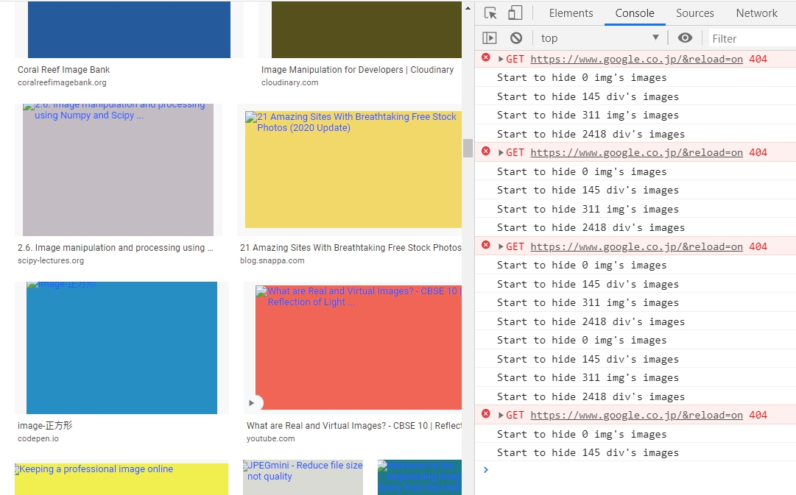
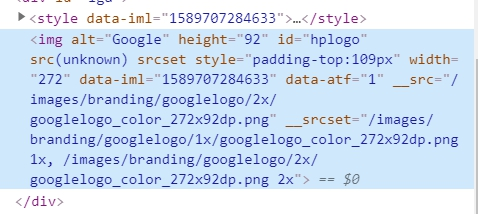
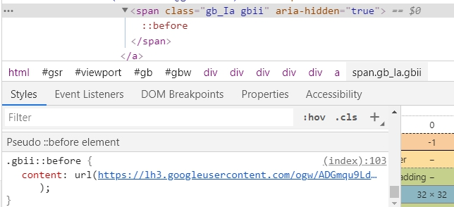
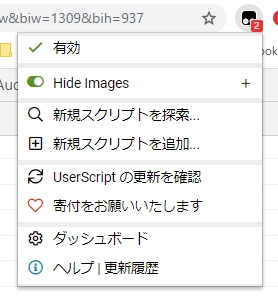

# hide-images-userscript

+ An userscript for hiding all images in web
+ (maybe for image crawler at home)

### Usage

+ Visit [hide-image.user.js](https://github.com/Aoi-hosizora/hide-images-userscript/raw/master/dist/hide-images.user.js) to install userscript to `TamperMonkey` / `GreaseMonkey` plugin

### Tips

+ The origin attribute will rename to `_xxx`, see the second screenshot.
+ If the image set in an unusual attribute or in css, it will have no effect, see the third screenshot.
+ This script is just for a temporary use, please stop in userscript control panel, see the fourth screenshot.

### Screenshot

||||
|:---:|:---:|:---:|

### References

+ [Tampermonkey documentation](https://www.tampermonkey.net/documentation.php)
